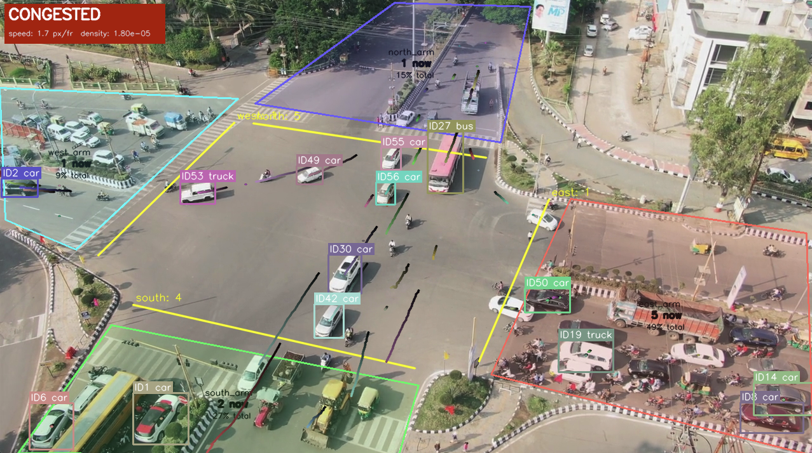
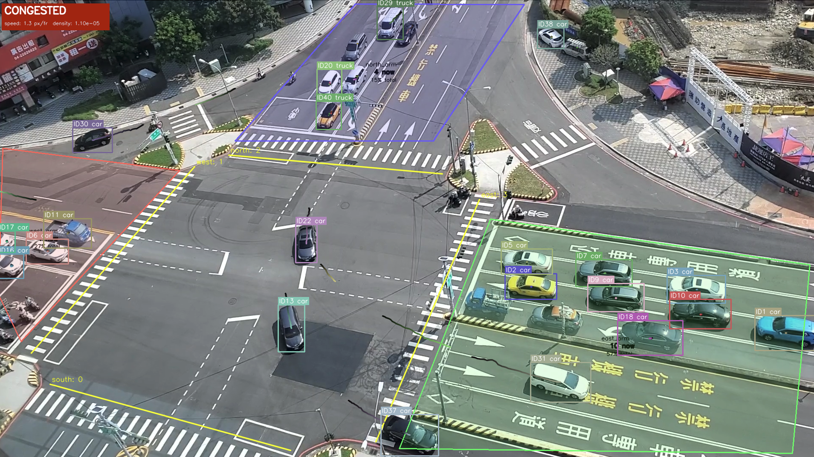

# TrafficNet

Most signalized intersections already have surveillance cameras. TrafficNet turns that existing footage into structured traffic data , vehicle counts, lane utilization, and congestion state , with no additional hardware.

## What was built

The core contribution is a three-layer pipeline where each layer has a single responsibility and communicates through a clean interface, making any layer independently replaceable.

**A multi-object tracker written from scratch.** Rather than using an off-the-shelf tracking library, I implemented the full SORT-style tracking pipeline ourselves. This includes a Kalman filter with a six-dimensional state vector encoding each vehicle's position, size, and velocity under a constant-velocity motion model. The filter runs a predict-then-correct cycle every frame , predicting where each vehicle will be before new detections arrive, then correcting that estimate when a detection is matched. For data association, I built the IoU cost matrix and wired it to SciPy's Hungarian algorithm implementation to find the globally optimal assignment of detections to tracks. A track lifecycle protocol handles the full identity lifespan: tentative tracks are promoted to active after two consecutive matches and terminated after five consecutive unmatched frames, bridging short occlusions without creating ghost tracks.

**A stateful vehicle counting monitor.** The naive approach , checking whether a bounding box center crossed a line , misses large vehicles and is prone to jitter. Instead I implemented a `CountingLineMonitor` class that tracks the signed side of the line for each vehicle's leading edge every frame. The moment that sign flips, a crossing is recorded. Each vehicle identity is counted at most once per line regardless of reversals, and the count updates live on screen the instant it happens.

**An instantaneous lane utilization metric.** Each approach arm of the intersection is covered by a manually configured polygon zone. Every frame, the system takes a snapshot of how many active tracks are inside each zone. Utilization is computed as the ratio of each zone's accumulated vehicle-frame count to the total across all zones , a vehicle-count-weighted metric that directly reflects which arm carries the most traffic throughout the video.

**A joint speed-density congestion detector.** Congestion is flagged when two conditions are simultaneously true: the average speed derived from Kalman velocity states falls below a scene-specific threshold, and the spatial density of active tracks exceeds a second threshold. Either condition alone is insufficient , slow speed without density could just be a single slow vehicle, and high density without slow speed is just busy flowing traffic. A ten-frame majority-vote smoothing window prevents transient slowdowns from triggering false alarms.

**An interactive calibration tool.** Because zones and counting lines are specific to each camera viewpoint, I built `calibrate.py` , a point-and-click editor that opens a video frame and lets you drag line endpoints and polygon corners directly on screen with your mouse. Saving writes the coordinates back to the scene's configuration file. This made per-scene tuning practical without manually editing pixel coordinates.

## Results

The tracker was evaluated on two UA-DETRAC sequences using CLEAR MOT metrics. The full pipeline achieves 26.2% MOTA on MVI_20011 and 6.3% on MVI_20032. The more telling number is identity switches: 49 total across both sequences, compared to 5,519 when the tracker is removed entirely , a 113-fold reduction. An ablation study showed that replacing the Kalman filter with position-only tracking or the Hungarian algorithm with greedy matching produces negligible MOTA change on highway footage, which is expected: the value of both components shows up in dense, stop-and-go intersection traffic rather than sparse highway sequences where vehicles move predictably in straight lines.

The analytics layer was validated qualitatively on two publicly sourced intersection videos. Congestion flags aligned with visually obvious stopped phases, crossing counts incremented correctly at each arm, and lane utilization distributions reflected the observed vehicle density per zone.

## Demo





## Structure

```
tracking/         Kalman filter, Hungarian assignment, tracker, ablation baselines
analytics/        CountingLineMonitor, lane utilization, congestion detector
detection/        YOLOv8 wrapper
visualization/    On-frame drawing utilities
scenes/           Per-scene spatial configuration files
calibrate.py      Interactive zone and line editor
main.py           Live pipeline entry point
evaluate.py       UA-DETRAC quantitative evaluation
```
